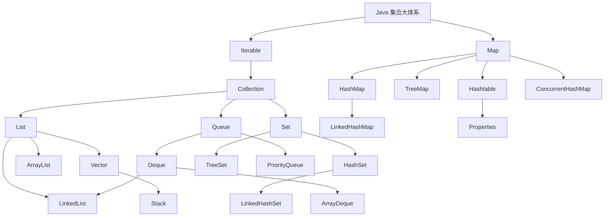
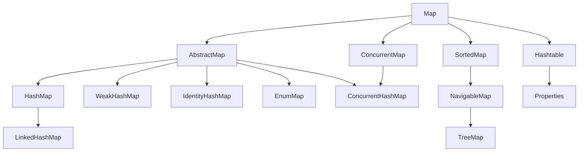

# Java 集合族谱

## 1. 为什么先看族谱

集合这一章最容易乱的地方，不是某个类不会用，而是：

- 不知道谁和谁是什么关系
- 不知道哪个是接口，哪个是实现类
- 不知道 `Collection` 和 `Map` 到底是不是一支

所以正式学集合前，先把“家谱”看清很重要。

## 2. 最大的总结构

Java 集合大体系可以先分成两块：

- `Collection`
- `Map`

注意：

- `Collection` 和 `Map` 是并列关系
- `Map` 不是 `Collection` 的子接口

## 3. 一个基础可扩展版族谱

```text
Java 集合大体系
├─ Collection
│  ├─ List
│  │  ├─ ArrayList
│  │  ├─ LinkedList
│  │  └─ Vector
│  ├─ Set
│  │  ├─ HashSet
│  │  ├─ LinkedHashSet
│  │  └─ SortedSet
│  │     └─ NavigableSet
│  │        └─ TreeSet
│  └─ Queue
│     ├─ Deque
│     │  ├─ ArrayDeque
│     │  └─ LinkedList
│     └─ PriorityQueue
│
└─ Map
   ├─ HashMap
   ├─ LinkedHashMap
   ├─ Hashtable
   ├─ SortedMap
   │  └─ NavigableMap
   │     └─ TreeMap
   └─ ConcurrentMap
      └─ ConcurrentHashMap
```

## 3.1 Mermaid 图：集合整体结构



## 3.2 Mermaid 图：Map 重点实现关系



## 4. 一个更详细的族谱版本

下面这版不要求你一遍全背下来，但它更接近“面试会涉及到的常见范围”。

```text
Java 集合框架
├─ Iterable
│  └─ Collection
│     ├─ List
│     │  ├─ AbstractList
│     │  │  ├─ ArrayList
│     │  │  └─ AbstractSequentialList
│     │  │     └─ LinkedList
│     │  └─ Vector
│     │     └─ Stack
│     │
│     ├─ Set
│     │  ├─ AbstractSet
│     │  │  ├─ HashSet
│     │  │  │  └─ LinkedHashSet
│     │  │  └─ EnumSet
│     │  └─ SortedSet
│     │     └─ NavigableSet
│     │        └─ TreeSet
│     │
│     └─ Queue
│        ├─ Deque
│        │  ├─ ArrayDeque
│        │  └─ LinkedList
│        ├─ PriorityQueue
│        └─ BlockingQueue
│           ├─ ArrayBlockingQueue
│           ├─ LinkedBlockingQueue
│           └─ PriorityBlockingQueue
│
└─ Map
   ├─ AbstractMap
   │  ├─ HashMap
   │  │  └─ LinkedHashMap
   │  ├─ WeakHashMap
   │  ├─ IdentityHashMap
   │  ├─ EnumMap
   │  └─ ConcurrentHashMap
   ├─ SortedMap
   │  └─ NavigableMap
   │     └─ TreeMap
   ├─ Hashtable
   │  └─ Properties
   └─ ConcurrentMap
      └─ ConcurrentHashMap
```

## 5. 详细版里哪些是当前阶段最需要认识的

上面的类很多，但不是每个都要同等力度去学。

### 第一层：必须认识

- `Collection`
- `Map`
- `List`
- `Set`
- `Queue`
- `Deque`
- `ArrayList`
- `LinkedList`
- `HashSet`
- `TreeSet`
- `HashMap`
- `LinkedHashMap`
- `TreeMap`
- `Hashtable`
- `ConcurrentHashMap`

### 第二层：知道存在即可

- `Vector`
- `Stack`
- `ArrayDeque`
- `PriorityQueue`
- `Properties`
- `WeakHashMap`
- `IdentityHashMap`
- `EnumSet`
- `EnumMap`

### 第三层：并发场景里再深挖

- `BlockingQueue`
- `ArrayBlockingQueue`
- `LinkedBlockingQueue`
- `PriorityBlockingQueue`

## 6. 为什么要把 Iterable 也放进来

因为很多集合都支持：

- `for-each`
- 迭代器遍历

而这一能力的上游接口就是：

- `Iterable`

所以从“遍历能力”角度看，`Iterable -> Collection` 这条线很值得知道。

## 7. 为什么抽象类也值得认识

像这些抽象类：

- `AbstractCollection`
- `AbstractList`
- `AbstractSequentialList`
- `AbstractSet`
- `AbstractMap`

当前阶段不用背源码实现，但要知道它们存在的意义：

- 为常见集合实现类提供通用骨架

面试里如果问到“为什么 Java 集合框架设计这么多层”，抽象类这一层就是答案的一部分。

## 8. List 这一支的详细理解

### ArrayList

- 最常用
- 底层基于数组
- 查询和尾部追加常见

### LinkedList

- 更偏链表语义
- 也能作为 `Deque` 使用

### Vector

- 早期类
- 线程安全

### Stack

- 基于 `Vector`
- 现在通常不是主流推荐方案

## 9. Set 这一支的详细理解

### HashSet

- 最常见
- 不可重复
- 底层和哈希思想相关

### LinkedHashSet

- 在 `HashSet` 基础上保留更稳定的迭代顺序

### TreeSet

- 更偏排序

### EnumSet

- 用于枚举类型的集合

## 10. Queue / Deque 这一支的详细理解

### Queue

- 更偏先进先出语义

### Deque

- 双端队列
- 可以两头进出

### ArrayDeque

- 常见双端队列实现

### PriorityQueue

- 更偏优先级出队

### BlockingQueue

- 并发章节里更常见

## 11. Map 这一支的详细理解

### HashMap

- 最常用的 `Map`

### LinkedHashMap

- 在 `HashMap` 基础上更强调顺序表现

### TreeMap

- 更偏按 key 的排序规则组织数据

### Hashtable

- 早期线程安全实现

### ConcurrentHashMap

- 并发场景下最常见的线程安全 `Map`

### Properties

- 基于 `Hashtable`
- 常用于配置项读取

### WeakHashMap

- 和弱引用相关
- 当前阶段只要知道存在即可

### IdentityHashMap

- key 比较规则和普通 `equals()` 语义不一样
- 当前阶段只要知道存在即可

### EnumMap

- 专门给枚举类型做 key 的 `Map`

## 12. 这一版详细族谱可能会在哪些题里出现

这份详细图主要服务这些题：

1. `Collection` 和 `Map` 有什么关系
2. `List`、`Set`、`Queue` 分别是什么
3. `HashMap`、`Hashtable`、`ConcurrentHashMap` 有什么区别
4. `HashSet`、`LinkedHashSet`、`TreeSet` 有什么区别
5. `ArrayList` 和 `LinkedList` 有什么区别
6. `LinkedList` 为什么既能做 `List` 也能做队列
7. `Properties` 属于哪一支
8. `TreeMap`、`TreeSet` 为什么和排序相关

## 13. 怎么用这份族谱复习

建议顺序：

1. 先只看上面的简版总图
2. 再看详细版里“必须认识”的那一层
3. 之后随着章节推进，再回头补“知道存在即可”的类

不要一上来强背完整图，否则很容易记乱。

## 14. Collection 这一支怎么理解

`Collection` 更像“存一批元素”的总接口。

它下面最重要的三支是：

- `List`
- `Set`
- `Queue`

### 4.1 List

特点：

- 有序
- 可重复

常见实现类：

- `ArrayList`
- `LinkedList`
- `Vector`

### 4.2 Set

特点：

- 不可重复

常见实现类：

- `HashSet`
- `LinkedHashSet`
- `TreeSet`

### 4.3 Queue

特点：

- 更偏队列语义

常见实现类：

- `PriorityQueue`
- `ArrayDeque`
- `LinkedList`

## 15. 为什么 LinkedList 会在两个地方出现

因为 `LinkedList` 不只是一个普通的 `List` 实现。

它同时也可以承担：

- 双端队列 `Deque`

所以在家谱里你会看到它既属于 `List` 常见实现，也常出现在 `Queue/Deque` 相关讨论里。

## 16. Set 这一支再细分

### HashSet

可以先记：

- 最常见
- 无序
- 不可重复

### LinkedHashSet

可以先记：

- 在 `HashSet` 基础上更强调顺序表现

### TreeSet

可以先记：

- 更偏排序

它和下面这些接口关系更近：

- `SortedSet`
- `NavigableSet`

## 17. Map 这一支怎么理解

`Map` 用来存：

- 键值对

也就是：

- `key -> value`

它不属于 `Collection` 这一支，但通常会和集合一起学习。

## 18. Map 的常见实现类

### 8.1 HashMap

最常用的 `Map` 实现类。

### 8.2 LinkedHashMap

可以先记：

- 在 `HashMap` 基础上更强调顺序表现

### 8.3 TreeMap

可以先记：

- 更偏按 key 的规则进行组织

它和：

- `SortedMap`
- `NavigableMap`

关系更近。

### 8.4 Hashtable

可以先记：

- 比较老
- 线程安全
- 现在一般不是主力

### 8.5 ConcurrentHashMap

可以先记：

- 并发场景下常见的线程安全 `Map`

当前基础阶段只需知道它的定位，不必一开始就深挖并发实现细节。

## 19. 抽象类这一层要不要知道

要知道，但第一遍不用背太死。

常见抽象类有：

- `AbstractCollection`
- `AbstractList`
- `AbstractSet`
- `AbstractMap`

它们的作用可以先简单理解为：

- 给具体实现类提供一部分通用逻辑

当前阶段只要知道“接口下面通常还夹着一层抽象类”就够了。

## 20. 这一章最容易混的几个点

### 10.1 Map 不是 Collection 子接口

这是高频易混点。

### 10.2 List、Set、Queue 都属于 Collection

这一点要先分清。

### 10.3 HashSet 和 HashMap 不是同一个分支

- `HashSet` 属于 `Set`
- `HashMap` 属于 `Map`

### 10.4 LinkedList 既能当 List，也能参与队列语义

所以它经常出现在两个上下文里。

## 21. 当前阶段最该记住的族谱主线

如果你不想一次背太多，先记住这条主线：

1. 集合大体系分成 `Collection` 和 `Map`
2. `Collection` 下最重要的是 `List`、`Set`、`Queue`
3. `List` 常见是 `ArrayList`、`LinkedList`
4. `Set` 常见是 `HashSet`、`LinkedHashSet`、`TreeSet`
5. `Map` 常见是 `HashMap`、`LinkedHashMap`、`TreeMap`、`Hashtable`、`ConcurrentHashMap`

## 22. 一句话总结

集合族谱最重要的不是记全每个类，而是先建立“Collection 一支”和 “Map 一支”这两棵树的总图，再往下逐层展开。
