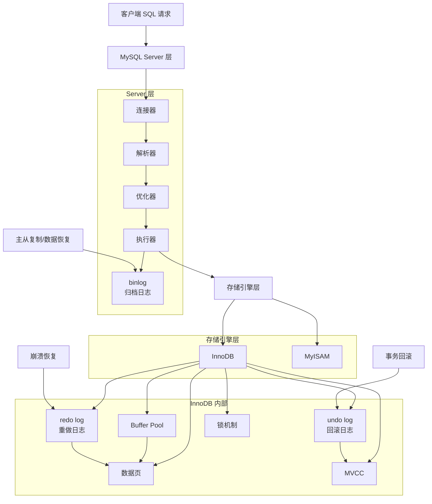
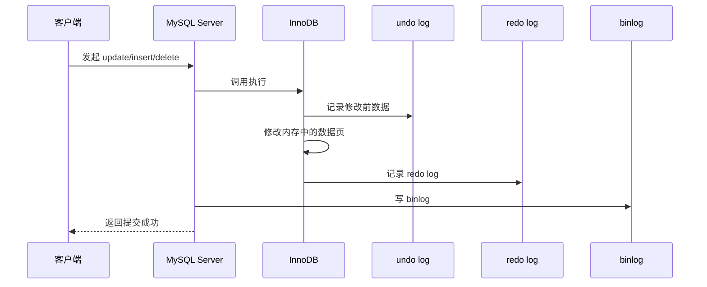

# MySQL 日志与存储引擎关系图

## 1. 这份图是干什么的
这份图主要帮你把下面几个东西一次性串起来：

- `MySQL Server`
- `存储引擎`
- `InnoDB`
- `undo log`
- `redo log`
- `binlog`
- `MVCC`

很多人面试时这些名词都知道，但一追问它们的层次关系，就容易乱。

你可以先看图，再看下面的解释。

---

## 2. MySQL 日志与存储引擎关系总图

---

## 3. 事务提交与日志流转图

---

## 4. 你怎么理解这张图

### 4.1 Server 层和存储引擎层
你可以这样理解：

> MySQL 从大层次上可以分成 Server 层和存储引擎层。像连接、SQL 解析、优化、执行这些属于 Server 层；真正负责数据存取的是存储引擎层。

面试里再补一句：

> `binlog` 是 Server 层的日志，而 `redo log`、`undo log` 是 InnoDB 这个存储引擎里的日志。

---

### 4.2 存储引擎是什么
面试回答：

> 存储引擎可以理解成 MySQL 底层真正负责数据存储和读取的实现方式，不同存储引擎支持的能力不一样。

常见的先记两个：

- `InnoDB`：支持事务、行锁、MVCC，现在最常用
- `MyISAM`：不支持事务，早期用得多，现在面试主要是拿来和 InnoDB 对比

---

### 4.3 undo log 是干什么的
面试回答：

> `undo log` 记录的是数据修改前的旧值，主要有两个作用，一个是事务回滚，一个是给 `MVCC` 提供历史版本。

一句话版：

> `undo log` 管回滚，也管版本链。

---

### 4.4 redo log 是干什么的
面试回答：

> `redo log` 是 InnoDB 的重做日志，主要作用是保证事务提交后的持久性。哪怕数据页还没正式刷盘，只要 `redo log` 已经落下来了，崩溃恢复时也能把数据补回来。

一句话版：

> `redo log` 主要解决的是提交后不能丢的问题。

---

### 4.5 binlog 是干什么的
面试回答：

> `binlog` 是 MySQL Server 层的归档日志，主要用于主从复制和数据恢复。

一句话版：

> `binlog` 主要偏复制和归档，不是 InnoDB 独有的。

---

### 4.6 MVCC 和 undo log 的关系
面试回答：

> `MVCC` 是多版本并发控制，它之所以能让读请求读到历史快照，本质上就是因为底层有 `undo log` 提供旧版本数据。

一句话版：

> 没有 `undo log`，很多 `MVCC` 的历史版本就没法成立。

---

## 5. 面试时最容易被问的区别

### redo log 和 binlog 的区别
你可以这样答：

> `redo log` 是 InnoDB 层的日志，主要用于崩溃恢复和保证持久性；`binlog` 是 Server 层的日志，主要用于主从复制和归档恢复。

---

### undo log 和 redo log 的区别
你可以这样答：

> `undo log` 记录的是修改前的数据，偏回滚和 MVCC；`redo log` 记录的是为了保证提交后的持久性，偏崩溃恢复。

---

### 为什么既要 redo log 又要 binlog
你可以这样答：

> 因为两者职责不同。`redo log` 解决的是 InnoDB 崩溃恢复和持久性问题，`binlog` 解决的是 Server 层复制和归档问题，所以不能互相替代。

---

## 6. 最适合你现场说的一段
如果面试官问你这些日志和存储引擎的关系，你可以直接说：

> MySQL 整体上可以分成 Server 层和存储引擎层。`binlog` 属于 Server 层，主要用于主从复制和数据恢复；`redo log` 和 `undo log` 属于 InnoDB 这个存储引擎。`undo log` 记录修改前的数据，主要用于事务回滚和给 MVCC 提供历史版本；`redo log` 主要用于保证事务提交后的持久性，崩溃恢复也依赖它。简单说，`undo` 偏回滚和版本，`redo` 偏持久性，`binlog` 偏复制和归档。

---

## 7. 最值得先背的 7 句
1. **MySQL 可以分成 Server 层和存储引擎层。**
2. **`binlog` 属于 Server 层。**
3. **`redo log` 和 `undo log` 属于 InnoDB。**
4. **`undo log` 主要用于回滚和给 MVCC 提供历史版本。**
5. **`redo log` 主要用于保证事务提交后的持久性。**
6. **`binlog` 主要用于主从复制和数据恢复。**
7. **简单说，undo 管回滚和版本，redo 管持久性，binlog 管复制和归档。**

