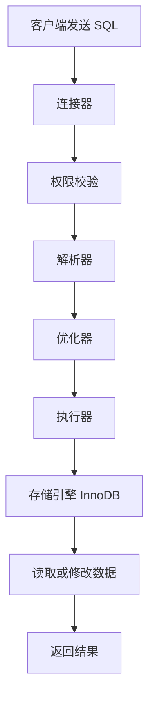

# MySQL SQL 执行流程笔记

## 1. 这份文档是干什么的

前面已经补了索引、事务、锁、日志。接下来就该把“一条 SQL 到 MySQL 之后到底怎么执行”这条线补上。

这类问题在面试里经常作为收束题出现：

1. 一条 SQL 发送到 MySQL 后经历哪些阶段。
2. MySQL Server 层和存储引擎层怎么配合。
3. 连接器、解析器、优化器、执行器分别做什么。
4. 查询 SQL 和更新 SQL 的执行流程有什么差别。
5. 为什么执行流程会和索引、日志、锁都有关。

这一篇先只讲执行流程，慢 SQL 排查和 `explain` 单独放到下一篇。

## 2. 先记最核心的结论

先记住这几句：

1. **一条 SQL 进入 MySQL 后，通常会经历连接、解析、优化、执行、返回结果几个阶段。**
2. **MySQL 大体可以分为 Server 层和存储引擎层。**
3. **Server 层负责连接管理、SQL 解析、优化、执行调度。**
4. **存储引擎层负责真正的数据读写，比如 InnoDB。**
5. **查询 SQL 更关注索引和执行计划，更新 SQL 还会涉及锁和日志。**

## 3. 一条 SQL 的最基础执行流程

先记最基础版本：

1. 客户端发送 SQL。
2. MySQL 建立连接并做权限校验。
3. 解析器解析 SQL。
4. 优化器选择执行方案。
5. 执行器调用存储引擎。
6. 存储引擎读取或修改数据。
7. MySQL 返回结果。

面试里可以先这样开头：

> 一条 SQL 进入 MySQL 后，大致会经过连接器、解析器、优化器、执行器，最后由执行器调用存储引擎完成真正的数据访问。

## 4. 整体流程图



这张图先帮你建立基本顺序。

## 5. MySQL Server 层和存储引擎层

MySQL 不是所有事情都在一个层里做。

可以先粗略分成两层：

- MySQL Server 层
- 存储引擎层

### 5.1 Server 层做什么

Server 层主要负责：

- 连接管理
- 权限校验
- SQL 解析
- SQL 优化
- 执行调度
- binlog 记录

### 5.2 存储引擎层做什么

存储引擎层主要负责：

- 真正存储数据
- 读取数据页
- 修改数据页
- 维护索引
- 处理 InnoDB 的事务、锁、redo log、undo log

所以你要记住：

> Server 层更像 SQL 的入口和调度中心，存储引擎层才是真正接触数据的地方。

## 6. 连接器做什么

连接器负责客户端和 MySQL 建立连接。

它主要做：

- 建立连接
- 身份认证
- 权限校验
- 连接管理

面试里不用讲太深，可以这样说：

> SQL 先通过连接器进入 MySQL，连接器负责建立连接、校验身份和权限，确认这个用户有没有执行对应 SQL 的资格。

## 7. 解析器做什么

解析器负责看 SQL 写得对不对，以及把 SQL 解析成 MySQL 能理解的结构。

它主要做：

- 词法分析
- 语法分析
- 检查 SQL 语法是否正确

如果 SQL 写错了，比如：

```sql
select from user where id = 1;
```

这类问题通常在解析阶段就会报错。

一句话记：

> 解析器负责看 SQL 能不能被正确理解。

## 8. 优化器做什么

优化器负责选择它认为成本较低的执行方案。

比如：

- 选择走哪个索引。
- 判断是否全表扫描。
- 决定多表 join 的顺序。
- 估算不同执行计划的成本。

这也是为什么有时候你建了索引，MySQL 不一定真的会用。

因为优化器会根据统计信息和成本估算做选择。

一句话记：

> 优化器不是简单看有没有索引，而是选择它认为更合适的执行计划。

## 9. 执行器做什么

执行器会根据优化器给出的执行计划真正去执行 SQL。

它主要做：

- 调用存储引擎接口。
- 按执行计划读取或修改数据。
- 判断权限和条件。
- 返回结果。

如果是查询：

- 执行器调用 InnoDB 去读数据。
- InnoDB 根据索引或表扫描找到记录。
- 执行器再把符合条件的数据返回。

## 10. 存储引擎做什么

存储引擎才是真正处理数据读写的地方。

以 InnoDB 为例，它会处理：

- B+ 树索引访问。
- 聚簇索引和二级索引。
- 回表。
- 行锁。
- MVCC。
- redo log。
- undo log。

所以前面学的索引、锁、事务、日志，最后都会落回到存储引擎这一层。

## 11. 查询 SQL 的大致流程

以普通查询为例：

```sql
select name from user where id = 10;
```

大致流程是：

1. 客户端发送 SQL。
2. 连接器校验连接和权限。
3. 解析器解析 SQL。
4. 优化器判断是否可以走主键索引。
5. 执行器调用 InnoDB。
6. InnoDB 通过索引找到数据。
7. 返回结果。

这条线主要关联：

- 索引
- 执行计划
- 回表
- 覆盖索引

## 12. 更新 SQL 的大致流程

以更新为例：

```sql
update user set name = 'Tom' where id = 10;
```

大致流程是：

1. 客户端发送 SQL。
2. 连接器校验连接和权限。
3. 解析器解析 SQL。
4. 优化器选择执行计划。
5. 执行器调用 InnoDB 找到目标记录。
6. InnoDB 对相关记录加锁。
7. 记录 undo log，方便回滚和 MVCC。
8. 修改内存页中的数据。
9. 记录 redo log。
10. Server 层记录 binlog。
11. 提交事务并返回结果。

这条线主要关联：

- 锁
- undo log
- redo log
- binlog
- 两阶段提交

## 13. 为什么执行流程很重要

因为很多 MySQL 问题最后都能落回执行流程。

比如：

- SQL 慢，可能是优化器没选好索引。
- 查询慢，可能是扫描行数太多。
- 更新慢，可能是锁等待。
- 主从问题，可能和 binlog 有关。
- 崩溃恢复，可能和 redo log 有关。

所以执行流程不是孤立知识点，而是把索引、锁、事务、日志串起来的一条线。

## 14. 面试里怎么回答“一条 SQL 怎么执行”

可以直接这样说：

> 一条 SQL 进入 MySQL 后，首先通过连接器建立连接并做权限校验，然后由解析器进行词法和语法分析，再由优化器选择执行计划，比如决定走哪个索引，之后执行器按照执行计划调用存储引擎接口。真正的数据读取或修改由存储引擎完成，比如 InnoDB 会涉及索引、锁、MVCC、redo log、undo log 等机制，最后执行器把结果返回给客户端。

如果是更新语句，可以再补一句：

> 如果是更新类 SQL，还会涉及行锁、undo log、redo log、binlog 和事务提交过程。

## 15. 当前阶段最值得先背的版本

> 一条 SQL 进入 MySQL 后，大致会经过连接器、解析器、优化器、执行器和存储引擎。连接器负责连接和权限，解析器负责解析 SQL，优化器负责选择执行计划，执行器负责调用存储引擎，存储引擎负责真正的数据读写。查询语句重点关注索引和执行计划，更新语句还会涉及锁、undo log、redo log、binlog 和事务提交。

## 16. 接下来怎么继续

执行流程看完后，下一步按顺序补：

1. `explain` 怎么看。
2. 慢 SQL 怎么排查。
3. 高频面试题和口语回答版。