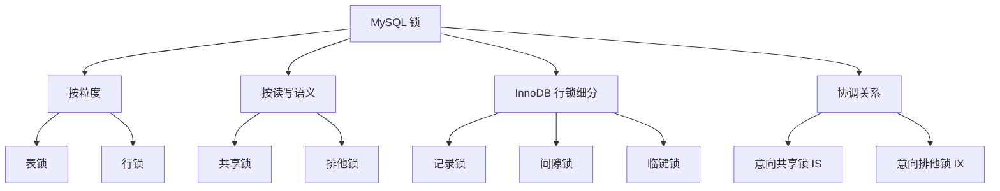

# MySQL 锁笔记

## 1. 这份文档是干什么的

锁是接在事务、隔离级别、MVCC 后面继续追问的高频点。

面试官常见追问路径是：

1. 为什么数据库需要锁。
2. 行锁和表锁有什么区别。
3. 共享锁和排他锁是什么。
4. InnoDB 为什么支持行锁。
5. 什么是记录锁、间隙锁、临键锁。
6. MVCC 和锁是什么关系。
7. 什么是死锁，怎么排查和避免。

这一篇先把 MySQL 锁的面试主线讲顺。

## 2. 先记最核心的结论

先记住这几句：

1. **锁的核心作用是控制并发读写，保证数据正确性。**
2. **MySQL 锁可以从不同角度分类，比如表锁/行锁、共享锁/排他锁、记录锁/间隙锁/临键锁。**
3. **InnoDB 支持行级锁，前提通常是查询能命中索引。**
4. **MVCC 主要优化普通读，锁主要保证当前读和写操作的并发正确性。**
5. **间隙锁和临键锁常用于解决范围并发插入带来的幻读问题。**
6. **死锁本质上是多个事务互相等待对方释放锁。**

## 3. MySQL 锁可以怎么分类

这是很多人容易乱的一点。

因为面试官嘴里的“锁”，有时候不是同一个分类维度。

更稳的理解方式是：

### 3.1 按粒度分

- 表锁
- 行锁

一句话记忆：

> 表锁锁整张表，粒度大；行锁锁具体记录，粒度小。

### 3.2 按读写语义分

- 共享锁 `Shared Lock`
- 排他锁 `Exclusive Lock`

一句话记忆：

> 共享锁更偏“大家都能读”，排他锁更偏“我在改，别人先别动”。

### 3.3 按 InnoDB 行锁细分

- 记录锁 `Record Lock`
- 间隙锁 `Gap Lock`
- 临键锁 `Next-Key Lock`

一句话记忆：

> 记录锁锁具体记录，间隙锁锁空隙，临键锁可以理解成记录锁加间隙锁。

### 3.4 协调表锁和行锁的

- 意向共享锁 `IS`
- 意向排他锁 `IX`

一句话记忆：

> 意向锁本质上是在告诉数据库：我准备在这张表里的某些行上加锁。

## 4. 一个总览图记法



你可以先粗暴记成：

- 表锁 / 行锁：是按锁的粒度分。
- 共享锁 / 排他锁：是按读写语义分。
- 记录锁 / 间隙锁 / 临键锁：是 InnoDB 行锁细分。
- 意向锁：是为了协调表锁和行锁。

## 5. 面试里怎么先总答一遍

可以直接这样说：

> MySQL 锁可以从不同角度分类。按粒度可以分成表锁和行锁；按读写语义可以分成共享锁和排他锁；InnoDB 里为了协调表锁和行锁，还有意向锁；而在行锁实现上，又常见记录锁、间隙锁和临键锁，所以面试里经常会从不同维度混着问。

## 6. 为什么数据库需要锁

数据库不是单线程玩具，真实项目里会有大量请求同时读写同一批数据。

如果没有锁，并发场景下可能出现这些问题：

- 两个请求同时扣同一份库存，导致超卖。
- 两个事务同时更新同一条记录，导致更新丢失。
- 一个事务读数据时，另一个事务正在修改，导致读到不稳定结果。

所以锁的本质是：

> 在并发访问共享数据时，限制某些操作的执行顺序，避免数据被改乱。

## 7. 锁和事务是什么关系

事务解决的是一组操作整体的一致性问题。

锁解决的是事务并发执行时，多个事务之间怎么互相影响的问题。

可以这样回答：

> 事务提供一组操作的整体语义，锁是事务隔离性的一个重要实现手段。多个事务并发读写同一批数据时，数据库需要通过锁来控制冲突，避免出现脏写、丢失更新等问题。

## 8. 锁和 MVCC 是什么关系

这个问题前面事务篇也提过，但锁这里要再强调一次。

可以先记这个版本：

> MVCC 和锁不是互斥关系，而是配合关系。MVCC 主要让普通读尽量不阻塞写，锁主要用于当前读、更新、删除、范围控制等需要强一致性的场景。

简单区分：

- 普通 `select`：很多时候走快照读，依赖 MVCC。
- `select ... for update`：当前读，需要加锁。
- `update`：当前读，需要加锁。
- `delete`：当前读，需要加锁。

## 9. 表锁和行锁

### 6.1 表锁

表锁就是锁住整张表。

特点：

- 粒度大。
- 冲突概率高。
- 并发能力较差。
- 实现相对简单。

如果一张表被锁住，其他事务对这张表的很多操作都可能被阻塞。

### 6.2 行锁

行锁就是锁住具体的行。

特点：

- 粒度小。
- 并发能力更强。
- 实现成本更高。
- 更容易出现死锁。

InnoDB 支持行级锁，这也是它适合高并发业务场景的重要原因之一。

## 10. InnoDB 行锁为什么和索引有关

这是一个很容易被问到的点。

可以先记：

> InnoDB 的行锁通常是加在索引记录上的。如果查询条件没有命中索引，可能会扫描更多记录，甚至导致锁范围变大。

所以并不是你写了 `where id = ?` 就一定只锁一行，关键要看：

- 条件字段有没有索引。
- 执行计划是否真的使用索引。
- 查询范围是否扩大。

面试里可以这样说：

> InnoDB 行锁依赖索引实现，如果 SQL 没有走索引，就可能锁住更多记录，严重时表现得像锁表，所以写更新 SQL 时要特别注意索引命中情况。

## 11. 共享锁和排他锁

### 8.1 共享锁

共享锁也叫读锁。

特点：

- 多个事务可以同时持有共享锁。
- 适合读读并发。
- 但会阻塞其他事务加排他锁修改数据。

可以理解为：

> 大家都可以看，但不能有人随便改。

### 8.2 排他锁

排他锁也叫写锁。

特点：

- 一个事务持有排他锁后，其他事务通常不能再对同一资源加共享锁或排他锁。
- 适合写操作。

可以理解为：

> 我要改这条数据，别人先别读锁写锁抢进来。

## 12. 意向锁是什么

意向锁是表级锁，用来表示“某个事务准备在表里的某些行上加锁”。

常见有：

- 意向共享锁 IS
- 意向排他锁 IX

初学阶段不用死磕太深，先记住它的作用：

> 意向锁主要是为了让表锁和行锁之间的冲突判断更高效。

比如数据库想判断“能不能给整张表加表锁”，如果没有意向锁，就可能要检查表中每一行有没有行锁；有了意向锁，就能先看表级意向锁，判断会更快。

## 13. 记录锁、间隙锁、临键锁

这是 InnoDB 锁里比较高频的一组。

### 10.1 记录锁 Record Lock

记录锁锁的是具体的一条索引记录。

例如：

```sql
select * from user where id = 10 for update;
```

如果 `id` 是主键索引，那么通常会锁住 `id = 10` 这一条记录。

### 10.2 间隙锁 Gap Lock

间隙锁锁的是两个索引记录之间的间隙。

它不锁具体已存在的记录，而是锁一个范围空隙，防止别的事务在这个范围里插入新记录。

可以先这样理解：

> 间隙锁主要是为了防止范围查询时，别的事务在范围里插入新数据，从而引发幻读问题。

### 10.3 临键锁 Next-Key Lock

临键锁可以理解成：

> 记录锁 + 间隙锁。

它既锁住已有记录，也锁住记录前面的间隙。

在 InnoDB 的可重复读隔离级别下，范围查询加锁时经常会涉及临键锁。

## 14. `select ... for update` 是什么

这是锁这条线里非常高频的一道题。

可以先这样答：

> `select ... for update` 是一种当前读，它会读取最新版本的数据，并且对读取到的记录加排他锁，防止其他事务同时修改。

更口语一点可以说：

> 它不是单纯“查一下”，而是“我先把这条数据查出来，同时先锁住，后面我准备改”。

所以它经常出现在这些场景里：

- 先查库存，再扣库存。
- 先查状态，再更新状态。
- 先确认记录是否存在，再做后续修改。

## 15. `select ... for update` 和普通 `select` 有什么区别

普通 `select`：

- 很多时候属于快照读。
- 更偏向读历史一致性版本。
- 通常不主动加这种排他锁。

`select ... for update`：

- 属于当前读。
- 要读最新版本。
- 会对命中的记录加锁。

所以你可以直接记：

> 普通 `select` 更偏“看看现在我能看到的版本”，而 `select ... for update` 更偏“我不但要看最新的，还要先锁住”。

## 16. `select ... for update` 为什么和索引强相关

这个点特别重要。

因为 InnoDB 的行锁通常是基于索引记录加的。

所以：

- 如果条件命中索引，锁会更精确。
- 如果条件不命中索引，扫描范围会扩大，锁范围也可能跟着扩大。

这也是为什么面试里经常会继续问：

> 如果 `select ... for update` 没走索引，会怎么样？

## 17. `select ... for update` 命中索引时会怎样

如果条件能准确命中索引，比如：

```sql
select * from user where id = 10 for update;
```

并且 `id` 是主键索引，那么通常会发生：

- 更快定位到目标记录。
- 锁范围更小。
- 并发冲突更可控。

面试里可以这样说：

> `select ... for update` 命中索引时，数据库通常能更精确地定位并锁住目标记录，所以性能和并发控制都会更好。

## 18. `select ... for update` 不走索引会怎样

这是最容易被问到的追问。

如果条件不走索引，常见后果是：

- MySQL 需要扫描更多记录。
- InnoDB 在扫描过程中可能锁住更多记录。
- 锁范围明显扩大。
- 并发性能下降。
- 严重时表现得像“锁了很多行”，甚至给人的感觉接近锁表。

所以不能简单理解成：

> 我只是查一条记录，肯定只锁一条。

真正决定锁范围的关键是：

- 有没有合适索引。
- 执行计划是否真的走了索引。
- 查询条件是不是把扫描范围放大了。

## 19. 为什么不走索引时容易出问题

因为 `select ... for update` 不是普通查询，它本身带着锁语义。

如果不走索引：

- 一边扫描，一边可能对扫描到的记录加锁。
- 扫描量越大，潜在锁冲突越大。
- 其他事务更容易被阻塞。

这也是为什么在高并发场景下，`select ... for update` 一旦没用好，就很容易带来：

- 锁等待
- 吞吐下降
- 死锁概率上升

## 20. 当前读为什么容易和锁关联

当前读要求读到的是最新数据，而且通常要防止别人同时修改。

常见当前读包括：

- `select ... for update`
- `select ... lock in share mode`
- `update`
- `delete`
- `insert`

因为当前读要读最新版本，所以不能只靠 MVCC 读历史快照，很多时候需要加锁控制并发。

## 21. 哪些 SQL 常见会加锁

这是另一个非常常见的追问。

先给一个最稳的判断：

- 普通 `select`：很多时候是快照读，不一定加这种行级排他锁。
- `select ... for update`：当前读，会加排他锁。
- `select ... lock in share mode`：当前读，会加共享锁。
- `update`：当前读，会加锁。
- `delete`：当前读，会加锁。
- `insert`：也会涉及锁，只是场景和表现不同。

所以不要一看到“查询语句”就说“不会加锁”，也不要一看到 `where` 就说“肯定只锁一行”。

## 22. 为什么不能只看 `where id = ?`

这个点特别容易答错。

很多人会直接说：

> `where id = ?`，那肯定只锁一行。

这个说法不稳。

更准确的判断应该是：

1. 先看它是不是当前读，比如是不是 `select ... for update`。
2. 再看 `id` 是否有索引。
3. 再看执行计划是否真的走了这个索引。
4. 最后再看查询条件是等值还是范围。

也就是说：

> `where id = ?` 只是一个条件长相，不足以直接说明锁范围。

## 23. 如果查询语句指定了 `id = ?`，怎么判断锁范围

最稳的判断顺序是：

### 20.1 先看是不是当前读

如果只是普通：

```sql
select * from user where id = 10;
```

很多时候它更偏快照读，不是我们这里说的“加排他锁锁住记录”的语义。

如果是：

```sql
select * from user where id = 10 for update;
```

那它就是当前读，要进入“锁范围判断”这条线。

### 20.2 再看 `id` 是否是索引列

如果 `id` 是主键或有合适索引：

- 更容易精准定位。
- 更可能只锁相关记录。

如果 `id` 没有索引：

- 就可能要扫描更多记录。
- 锁范围更可能扩大。

### 20.3 再看执行计划是否真的命中索引

这一步也很关键。

不是“有索引”就等于“一定用索引”。

所以更稳的说法是：

> 不仅要看字段有没有索引，还要看执行计划是否真的走了索引。

### 20.4 最后看是等值还是范围

等值条件通常更容易锁得精确一些。

范围条件更容易涉及：

- 多条记录
- 间隙锁
- 临键锁
- 更大的锁范围

所以：

- `id = 10` 和
- `id > 10 and id < 20`

它们的锁语义明显不一样。

## 24. 一个更稳的面试判断框架

你可以直接按这个顺序说：

> 先判断这条 SQL 是不是当前读，如果只是普通 select，很多时候不是这里讨论的加锁语义；如果是 select for update、update、delete 这种当前读，再看条件字段有没有索引，以及执行计划是否真的走了索引；最后再看是等值查询还是范围查询。只有这些都结合起来，才能更准确判断它是锁一行、锁多行，还是锁范围扩大。

## 25. 面试里怎么回答“`where id = ?` 是不是就只锁一行”

可以直接这样答：

> 不能只看 `where id = ?` 这一点，还要看这条 SQL 是不是当前读，比如是不是 `select ... for update`、update 或 delete；再看 `id` 是否有索引，以及执行计划是否真的走了索引。如果是当前读、又精准命中主键或唯一索引，通常锁会比较精确；但如果不走索引，哪怕写的是 `id = ?`，也可能因为扫描范围扩大而锁住更多记录。

## 26. 面试里怎么回答“`select ... for update` 不走索引会怎样”

可以直接这样答：

> `select ... for update` 属于当前读，会对读取到的记录加锁。InnoDB 的行锁通常依赖索引实现，如果 SQL 没有命中索引，就可能需要扫描更多记录，锁范围也会随之扩大，导致并发下降，严重时看起来会像锁住了大量记录。所以这类 SQL 在高并发场景下特别依赖索引是否命中。

## 27. 什么是死锁

死锁指的是多个事务互相等待对方释放锁，最后谁也继续不了。

典型例子：

1. 事务 A 锁住第 1 行，准备锁第 2 行。
2. 事务 B 锁住第 2 行，准备锁第 1 行。
3. A 等 B，B 等 A。
4. 互相等待，形成死锁。

一句话记忆：

> 死锁就是多个事务互相拿着对方想要的锁，谁也不释放。

## 28. 怎么减少死锁

常见思路：

- 尽量让多个事务按相同顺序访问资源。
- 事务尽量短，不要长时间持有锁。
- 更新条件尽量走索引，避免锁范围扩大。
- 避免在事务里做耗时的外部调用。
- 大批量更新可以分批处理。

面试可以这样说：

> 减少死锁的核心是降低锁持有时间、缩小锁范围，并让事务尽量按固定顺序访问资源。

## 29. 面试里怎么回答“MySQL 有哪些锁”

可以这样答：

> MySQL 锁可以从不同角度分类。按粒度可以分为表锁和行锁；按读写关系可以分为共享锁和排他锁；InnoDB 里还有意向锁，用来协调表锁和行锁；在行锁实现上，还经常会提到记录锁、间隙锁和临键锁。记录锁锁具体索引记录，间隙锁锁索引记录之间的范围，临键锁可以理解为记录锁加间隙锁，常用于可重复读级别下控制范围并发插入导致的幻读问题。

## 30. 面试里怎么回答“MVCC 和锁的区别”

可以这样答：

> MVCC 主要解决普通读和写之间的并发性能问题，让读操作可以读取合适的历史版本，减少阻塞；锁主要解决当前读、更新、删除等操作的并发正确性问题。两者不是互相替代，而是在 InnoDB 里配合使用。

## 31. 当前阶段最值得先背的版本

> MySQL 锁的核心作用是控制并发读写，保证数据正确性。按粒度可以分为表锁和行锁，InnoDB 支持行锁，但行锁通常依赖索引实现，如果 SQL 不走索引，锁范围可能扩大。按读写关系可以分为共享锁和排他锁。InnoDB 里还常见记录锁、间隙锁、临键锁，临键锁可以理解为记录锁加间隙锁，常用于控制范围查询下的并发插入问题。MVCC 主要优化普通读，锁主要保证当前读和写操作的正确性。

## 32. 接下来怎么继续

锁这篇看完后，下一步按顺序应该补：

1. MySQL 日志：redo log、undo log、binlog。
2. SQL 执行流程和慢 SQL 排查。
3. 高频面试题与口语回答版。