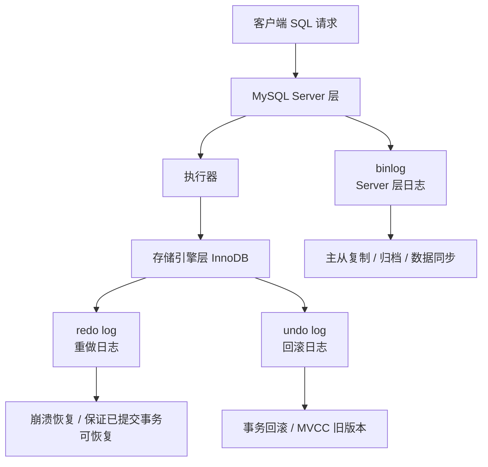
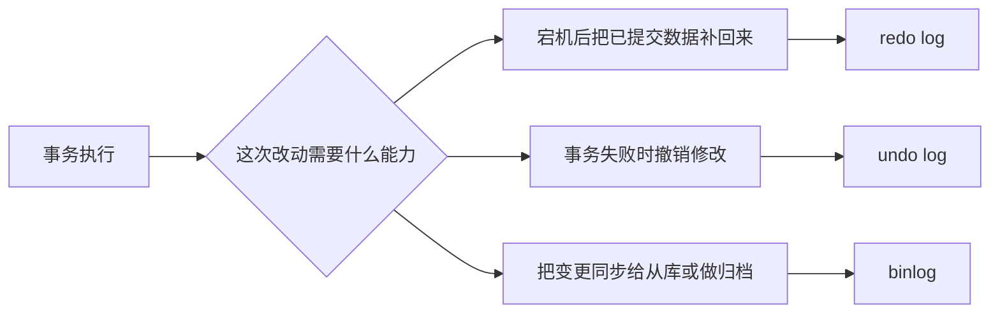
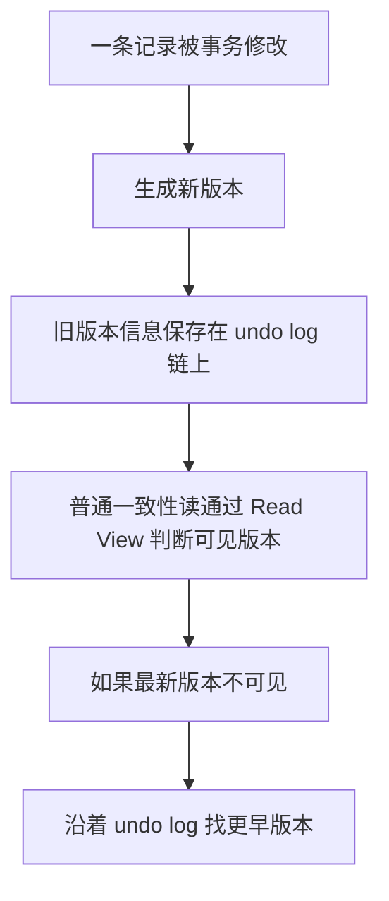
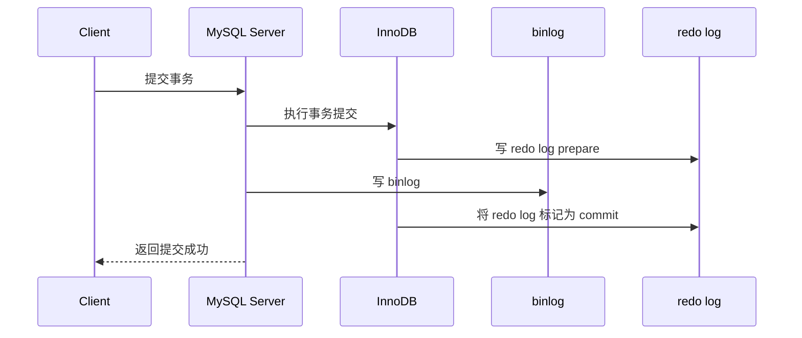
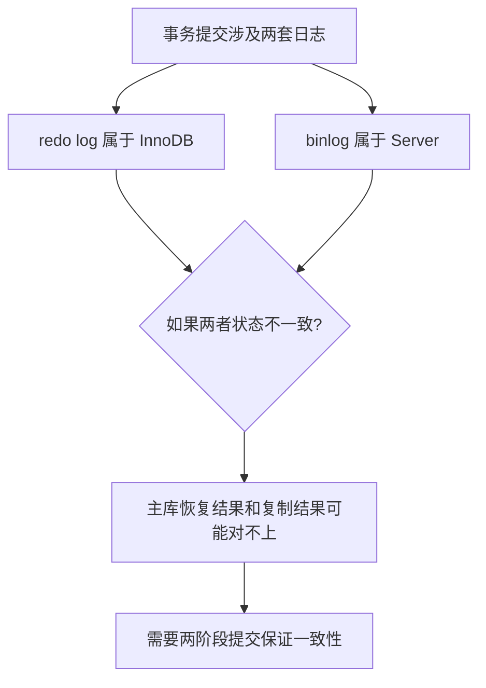

# MySQL 日志图解笔记

## 1. 这份文档是干什么的

这一篇不主打长文字解释，而是专门用图把 MySQL 日志里最容易混的几个点串起来：

- `redo log`
- `undo log`
- `binlog`
- MySQL Server 层和 InnoDB 层的关系
- 两阶段提交大概怎么走

如果前面已经看过 `mysql-log-note.md`，再看这篇会更容易把结构记住。

## 2. 三种日志的大框架关系图

先记住这件事：

- `binlog` 属于 `MySQL Server` 层。
- `redo log` 和 `undo log` 更贴近 `InnoDB`。
- 三者都重要，但解决的问题不同。

## 3. redo log、undo log、binlog 分工图

你可以把这三个日志先粗暴分工成这样：

- `redo log`：已经提交了，宕机后也得补回来。
- `undo log`：这次事务不想要了，要能撤回去。
- `binlog`：这次改动发生过，要能记下来给复制和归档用。

## 4. redo log 和 binlog 为什么不能混为一谈

这里最值得记的一句话：

> `redo log` 和 `binlog` 不是同一层日志，也不是同一种用途，所以不能简单替代。

## 5. undo log 和 MVCC 的关系图

你可以把它先记成：

- `undo log` 不只是为了回滚。
- 它还是 `MVCC` 能看到旧版本的重要基础之一。

## 6. 两阶段提交流程图

初学阶段先记住这个顺序：

1. `redo log` 先进入 `prepare`
2. 再写 `binlog`
3. 最后 `redo log commit`

## 7. 为什么要两阶段提交

你可以把它理解成：

> 两阶段提交不是为了“流程好看”，而是为了避免 `redo log` 成功、`binlog` 失败，或者反过来的不一致问题。

## 8. 当前阶段最值得先背的图像化记忆

先用一句话把图记住：

> `redo log` 负责已提交事务的恢复，`undo log` 负责回滚和 MVCC，`binlog` 负责归档和复制；因为 `redo log` 和 `binlog` 分属不同层，所以提交事务时需要两阶段提交来保证它们一致。

## 9. 怎么配合主线文档一起看

推荐顺序：

1. 先看 `mysql-log-note.md`
2. 再看这份 `mysql-log-diagram-note.md`
3. 最后回头复述一遍：三种日志分别干什么、为什么要两阶段提交